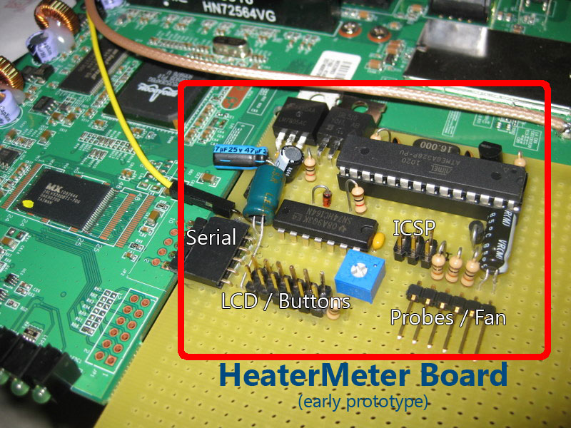

# An Introduction to LinkMeter / HeaterMeter
**HeaterMeter** (HM) is an AVR / Arduino microcontroller-based automatic BBQ controller.  Temperature data read from a standard "[Maverick](http://www.maverickhousewares.com/)" thermisor probe is used to adjust the speed of a blower fan motor mounted to the BBQ grill to maintain a specific set temperature point (setpoint).  Additional probes are used to monitor food and ambient temperatures, and these are displayed on a 16x2 LCD attached to the unit.  Buttons or serial commands can be used to adjust configuration of the device including adjustment of the setpoint or manually regulating fan speeds.

**LinkMeter** (LM) extends the functionality of the HeaterMeter by mounting the microcontroller inside an OpenWrt-compatible SoC device such as a Linksys WRT54GL router.  The OpenWrt software provides a web server for monitoring and configuration as well as the storage necessary to provide history data in the form of a CSV log, or a javascript-generated graph.

**LinkMeter Remote** (LMR) is an additional external device comprised of one or more temperature probes, a ATmega microcontroller, and an RFM12B 434/868/915MHz wireless transmitter. LMR transmits temperature data back to a HeaterMeter which has been built with the optional RFM12B receiver section. The temperature information replaces an internal HeaterMeter probe.