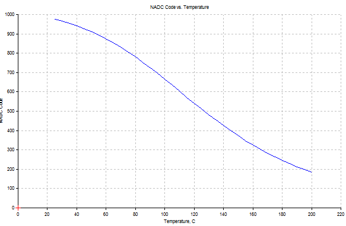
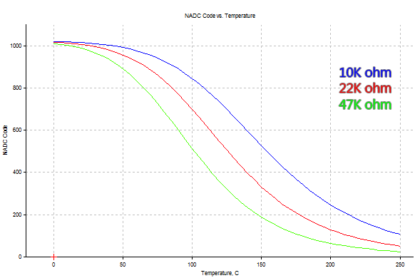

HeaterMeter uses resistive thermistor-based probes due to their availability and the fact that most BBQers already have some sort of meat thermometer. Maverick Industries makes several models of digital thermometers using thermistor probes with 2.5mm mono headphone jack connectors.

## Maverick ET-72/73

Labeled as
 * ET-7
 * ET-72
 * ET-73
 * ET-72/73

**Highly Recommended**

Available in two varieties, both "smoker probe" and "food probe" are the same internally and differ only in that the smoker probe is shorter, straight, and blunt compared to the food probe's pointed tip and 90 degree bend.
 * Standard 3ft length, rated to 410F maximum temperature
 * High Heat 6ft length, rated to 716F maximum temperature although some are only rated to 570F working temperature

Recommended HeaterMeter resistance: 10kohm (standard)

## Maverick ET-732

**Acceptable**

Note how closely this model number resembles the ET-72/73 specification. When run all together as ET-732 they are internally different probes. The 2.5mm connectors on these probes are slightly longer than the ET-72/73 and when inserted into the HeaterMeter jacks, can be pushed in too far and lose their connection. This can be avoided by cutting a 1/16" length of tubing and putting it on the connector, or using a small rubber grommet or washer.

These are also available in both "smoker probe" and "food probe"
  * High Heat 6ft length, rated to 716F maximum temperature. 3ft low heat probes are no longer available.

These probes are also subject to more _mysterious errors_ than the ET-72/73 probes, making the temperatures fluctuate for no apparent reason. The only solution is to ground the probe's braided shielding.

The response curve of these probes bottoms out around room temperature when used with the standard 10kohm HeaterMeter resistance, which causes them to read as "off". To get more usable range, replace the standard 10k resistors with 22k or even 47k 1% tolerance resistors.

If you already have ET-732 probes, you can use them, but because of the problems listed above, they are not recommended for new purchases.

## IKEA Fantast

**Not recommended**

These probes can be used, but they are wired backwards so the PCB mount probe jacks can not be used. They are also subject to the same floating _mysterious errors_ as the ET-732 probes. Their measurement device actually uses the probe resistance to charge and discharge a capacitor and measure how long it takes, then switches polarity and measures again.

 * Rated to 428F maximum temperature