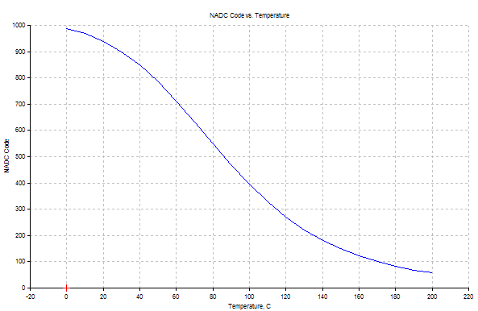

HeaterMeter uses resistive thermistor-based probes due to their availability and the fact that most BBQers already have some sort of meat thermometer. Maverick Industries makes several models of digital thermometers using thermistor probes with 2.5mm mono headphone jack connectors.

Use the [Probe Range Comparison Tool](http://capnbry.net/linkmeter/adctherm/) to compare ranges of the probe types. The standard HeaterMeter build uses 10000 (10k) ohm resist.

## Maverick ET-72/73

Labeled as
 * ET-7
 * ET-72
 * ET-73
 * ET-72/73

**Highly Recommended**

Available in two varieties, both "smoker probe" and "food probe" are the same internally and differ only in that the smoker probe is shorter, straight, and blunt compared to the food probe's pointed tip and 90 degree bend.
 * Standard 3ft length, rated to 410F maximum temperature
 * High Heat 6ft length, rated to 716F maximum temperature although some are only rated to 570F working temperature

Recommended HeaterMeter resistance: 10kohm (standard)

 * High Heat Smoker Probe [Amazon](https://www.amazon.com/dp/B008OWZMMW/ref=as_li_ss_til?tag=httpcapnbrnet-20&camp=0&creative=0&linkCode=as4&creativeASIN=B008OWZMMW&adid=1EE7Q885EA7E7N0DT955)
 * Standard Smoker Probe [Maverick](http://maverickhousewares.bigcartel.com/product/et-73-smoker-probe)
 * High Heat Food Probe [Maverick](http://maverickhousewares.bigcartel.com/product/et-72-73-high-heat-6ft-food-probe)
 * Standard Food Probe [Amazon](https://www.amazon.com/dp/B00B8NBL2O/ref=as_li_ss_til?tag=httpcapnbrnet-20&camp=0&creative=0&linkCode=as4&creativeASIN=B00B8NBL2O&adid=0NBFHY6JQDTCA1J3XBQ6&) [Maverick](http://maverickhousewares.bigcartel.com/product/et-7-et-72-et-902-probe)

## Thermoworks TX-1001X-OP

**Highly Recommended**

Thermoworks probes for their ChefAlarm system work well, and respond faster than ET-72/73 due to their smaller probe tips. Note these are thermistor-based probes, and not the high-precision Thermoworks thermocouple-based design. These probes are well built with better moisture resistance and larger temperature range too. The coefficients in LinkMeter may not be completely accurate because they are correlated off a ET-72/73 probe.
  * Cable length: 47 inches
  * Maximum working temperature: 644F
  * Maximum cable temperature: 700F

Recommended HeaterMeter resistance: 10k ohm (standard)

Manually enter these coefficients (built-in are wrong)
`6.6853001e-04,2.2231022e-04,9.9680632e-08`

  * TX-1001X-OP [Amazon](https://www.amazon.com/dp/B00EZB8W0K/ref=as_li_ss_til?tag=httpcapnbrnet-20&camp=0&creative=0&linkCode=as4&creativeASIN=B00EZB8W0K&adid=03P1SGNDWFZ85JC5W569&) [Themoworks](http://www.thermoworks.com/products/alarm/chefalarm.html#AccessoriesTab) 
  * TX-1002X-NP Needle Probe (500F max cable temperature) [Amazon](https://www.amazon.com/dp/B00EZBB8AQ/ref=as_li_ss_til?tag=httpcapnbrnet-20&camp=0&creative=0&linkCode=as4&creativeASIN=B00EZBB8AQ&adid=0J280WDZFM7N5XZM4XF3&) [Thermoworks](http://www.thermoworks.com/products/alarm/chefalarm.html#AccessoriesTab)

## Maverick ET-732

**Acceptable**

Note how closely this model number resembles the ET-72/73 specification. When run all together as ET-732 they are internally different probes. The 2.5mm connectors on these probes are slightly longer than the ET-72/73 and when inserted into the HeaterMeter jacks, can be pushed in too far and lose their connection. This can be avoided by cutting a 1/16" length of tubing and putting it on the connector, or using a small rubber grommet or washer.

These are also available in both "smoker probe" and "food probe"
  * High Heat 6ft length, rated to 716F maximum temperature. 3ft low heat probes are no longer available.

These probes are also subject to more _mysterious errors_ than the ET-72/73 probes, making the temperatures fluctuate for no apparent reason. The only solution is to ground the probe's braided shielding.

The response curve of these probes bottoms out around room temperature when used with the standard 10kohm HeaterMeter resistance, which causes them to read as "off". To get more usable range, replace the standard 10k resistors (R5, R16, R17, R18) with 22k or even 47k 1% tolerance resistors.

If you already have ET-732 probes, you can use them, but because of the problems listed above, they are not recommended for new purchases.

 * Food Probe [Amazon](https://www.amazon.com/dp/B00684ZYNK/ref=as_li_ss_til?tag=httpcapnbrnet-20&camp=0&creative=0&linkCode=as4&creativeASIN=B00684ZYNK&adid=061W9X7NN6KRC8XK1DXX&) [Maverick](http://maverickhousewares.bigcartel.com/product/et-732-food-probe)
 * Smoker Probe [Amazon](https://www.amazon.com/dp/B006XLWL7K/ref=as_li_ss_til?tag=httpcapnbrnet-20&camp=0&creative=0&linkCode=as4&creativeASIN=B006XLWL7K&adid=18BES922G0WB0PVSCJN0&) [Maverick](http://maverickhousewares.bigcartel.com/product/et-732-smoker-probe)

## IKEA Fantast

**Not recommended**

These probes can be used, but they are wired backwards so the PCB mount probe jacks can not be used. They are also subject to the same floating _mysterious errors_ as the ET-732 probes. Their measurement device actually uses the probe resistance to charge and discharge a capacitor and measure how long it takes, then switches polarity and measures again.

 * Rated to 428F maximum temperature

## Thermocouples

Thermocouples have a higher maximum temperature rating, but their low voltage change per degree requires special amplifier circuitry or special purpose thermocouple-reading chips. HeaterMeter hardware v4.2 and above has optional support for a thermocouple pit probe. Any K-type thermocouple is supported, and the HeaterMeter jack is a standard miniature type connector. Thermocouples with spade connectors can be used by clipping them to fit into the jack, although this isn't the most secure of connections.

* [Auber Instruments](http://www.auberins.com/) -> Temperature Sensors -> Thermocouple Sensors
* [Thermoworks](http://thermoworks.com/) -> Probes -> Thermocouple 
* [Amazon](http://www.amazon.com/s/?_encoding=UTF8&camp=1789&creative=390957&field-keywords=k%20thermocouple&linkCode=ur2&rh=i%3Aaps%2Ck%3Ak%20thermocouple&sprefix=k%20therm%2Caps%2C202&tag=httpcapnbrnet-20&url=search-alias%3Daps&linkId=A64FD5UPDR7NLWJ7)