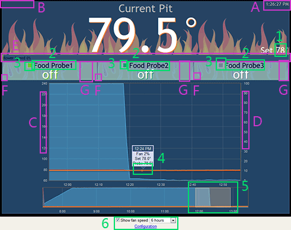

The LinkMeter Home or Status page displays the current temperature, fan speed and graph.

### Display Regions (Purple)

| Letter | Name | Description |
|--------|------|-------------|
| A | Last Update | The status page automatically updates and this time indicates the last update time. If the number is gray it indicates communication between the browser and LinkMeter is working, and the time is the last time LinkMeter received data from HeaterMeter. If the time is in red, it indicates communication to LinkMeter has failed and the time is the time of the last connection attempt. LinkMeter runs on UTC so the time displayed here is adjusted for your local time. Hovering your mouse over the time will display the full date. |
| B | Lid Open | If HeaterMeter is in lid open detect mode, the duration remaining is displayed here. Click to toggle lid open mode. |
| C | Graph Temperature | This axis is for the temperature of probes degrees. |
| D | Graph Fan Speed | This axis is the fan speed percent. |
| E | PID Output % | The current PID output percent is indicated by the size of the bar and the label. There may also be a lighter blue bar inside of the main bar indicating the current blower speed, if max fan speed isn't 100%. The exponential moving average of the fan speed is displayed as a translucent rectangle "pip" at the correct percentage |
| F | RF Status | If a probe is of type RF Wireless, the status of the remote connection is indicated in this area. Mouse over the connection icon for more information |
| G | Degrees Per Hour | If a probe has more than one hour's worth of data, and the current temperature is at least 1 degree higher than it was an hour ago, the number of degrees per hour is indicated here. If the temperature is below the high alarm point, duration remaining until that temperature is reached is also shown. |
| X | Not Shown | Orange regions in the upper graph indicate periods where the system was in lid open mode |

### Active Regions (Green)

Active regions indicated in green on the example image are interactable. Anything that changes configuration requires you to be logged in.

| Number | Name | Decription |
|--------|------|------------|
| 1 | Setpoint | Click to modify the target temperature. A number between 0 and -100 (negative 100) puts the fan into manual mode. Press ENTER to submit, ESC to cancel. |
| 2 | Probe Name | Click to change the probe's name on both the HeaterMeter and web interface. Press ENTER to submit, ESC to cancel. |
| 3 | Graph Legend | Click the box next to the probe name to toggle displaying its data in the graph. Pit and Setpoint can not be removed from the graph |
| 4 | Graph Tooltip | Mouse over or click the graph to display information from that time. The tooltip snaps to the closest probe point (not setpoint or fan speed). |
| 5 | Overview Graph | Zoom in on the top graph by dragging a selection on the lower overview graph. If the selection extends to the right edge of the overview graph, new points added while zoomed will be included in the selection automatically. Single click the overview graph to reset the selection. |
| 6 | Stuff | Toggle fan display of fan speed, set graph range, login (and return to home screen) or configuration (login and go to configuration page) |

### Hotkeys

| Key | Date added | Description | 
|:---:|------------|-------------|
| P | 2013-04-19 | Toggle the Pid Internals display (except Internet Explorer, including IE10)
