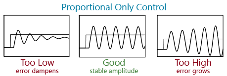

The default PID coefficients work well for a large Big Green Egg with the standard 6.7CFM in the cardboard mounting bracket in a Florida climate with the top vent only slightly open. You may have noted the amount of detail in that statement, which is my way of saying that they probably won't work for everyone. Depending on your cooker, fan size, mounting solution and even weather, the coefficients may need to be adjusted. 

## Before you can get started

First things first, the HeaterMeter can only control the temperature if:
 * The smoker is closed off enough that when the fan isn't running, the fire is getting snuffed out. If the temperature passes the setpoint and keeps on going higher and higher without the fan running, your smoker is letting too much air in.
 * The smoker needs to be open enough that the fan can provide enough air to maintain temperature. If the grill is closed up too much, the _static pressure_ inside can be too high and prevent the fan from ventilating your fire.

For my egg, the happy medium for 225F is to have the bottom vent closed all the way onto the fan mount and having the top dial vent only open wide enough to be able to insert a toothpick though one of the holes. For higher temperatures, the top vent is opened more and the bottom is always left closed. Once you've found your sweet spot you can move on to tuning the PID parameters.

## Manual Tuning
Stolen from [Wikipedia](http://en.wikipedia.org/wiki/PID_controller)
 * From the LinkMeter configuration page, set the controller to Proportional-only mode by setting B=0, I=0, D=0.
 * Increase the P until the output of the loop oscillates, then the P should be set to approximately half of that value for a "quarter amplitude decay" type response. 
 * Then increase I until any offset is corrected in sufficient time for the process. However, too much will cause instability. 
 * Finally, increase D, if required, until the loop is acceptably quick to reach its reference after a load disturbance. However, too much D will cause excessive response and overshoot. A fast PID loop tuning usually overshoots slightly to reach the setpoint more quickly.

Effects of increasing a parameter independently
<table>
<tr><th>Parameter</th><th>Rise time</th><th>Overshoot</th><th>Settling time</th><th>Steady-state error</th><th>Stability</th></tr>
<tr><td>P</td><td>Decrease</td><td>Increase</td><td>Small change</td><td>Decrease</td><td>Degrade</td></tr>
<tr><td>I</td><td>Decrease</td><td>Increase</td><td>Increase</td><td>Eliminate</td><td>Degrade</td></tr>
<tr><td>D</td><td>Minor change</td><td>Decrease</td><td>Decrease</td><td>No effect in theory</td><td>Improve if D small</td></tr>
</table>

## Ziegler-Nichols Closed Loop Method
 * **CAVEAT** I did not find the values produced by this method to be at all usable but it is presented here as an alternative to manual tuning.
 * Due to how slowly the temperature changes, set aside at least an hour for tuning. Start the smoker and let HeaterMeter control temperature at a desired setpoint for long enough for the grill to fully heat up. For webber grills and other with thin metal walls this can be pretty quick. For heavy ceramic cookers like the big green egg, wait at least 30 minutes for the entire smoker to come to temperature.
 * From the LinkMeter configuration page, set the controller to Proportional-only mode by setting B=0, I=0, D=0.
 * Watch the temperature which should now start to oscillate. If the error gets larger and larger over time, decrease the P PID parameter. If there is little to no oscillation, increase the P PID parameter. You're looking for oscillations with a fixed amplitude (distance between the min and max temperatures) and period (amount of time it takes to complete one min/max cycle)

 * When a value of P results in a sustained periodic oscillation in the output (or close to it), mark this critical value of P as Ku, the "ultimate gain". Also, measure the period of oscillation (in seconds), Pu, referred to as the "ultimate period".
 * Compute the new PID parameters using the Ziegler-Nichols parameters. PD is the constant representing the period of the Derivative lookback. In HeaterMeter it is an 30 point exponential moving average, so this value is approximately 30.
<table>
<tr><th colspan="2">Ziegler-Nichols</th></tr>
<tr><th>PID Parameter</th><th>Value</th></tr>
<tr><td>P</td><td>Ku / 1.7</td></tr>
<tr><td>I</td><td>Ku / (Pu / 2)</td></tr>
<tr><td>D</td><td>Ku * (Pu / 8) / PD</td></tr>
</table>
 * As an alternative to the Ziegler-Nichols parameters, there is an alternative calculation created by two other dudes, Tyreus and Luyblen, often called the TLC tuning rule
<table>
<tr><th colspan="2">Tyreus-Luyblen</th></tr>
<tr><th>PID Parameter</th><th>Value</th></tr>
<tr><td>P</td><td>Ku / 2.2</td></tr>
<tr><td>I</td><td>Ku / (2.2 * Pu)</td></tr>
<tr><td>D</td><td>Ku * (Pu / 6.3) / PD</td></tr>
</table>

## Experimental Tuning
While logged in to LinkMeter and on the Home screen, press 'P' on your keyboard to open the "PID Debug" information screen. Here you'll see up-to-the-second information on what factors are driving the output. This data can be used to tune your PID constants.

**P** Here's the easiest place to start. Think about what the acceptable temperature range is for operation. At what point of the pit temperature dropping do you want BWOOP BWOOP giver 'er all she's got, Captain! Divide 100 by that number. That's going to set the lower limit on the P value. For a setpoint 225F with a lower temperature limit of 215, P = 100/(225-215) = 10. That's your ballpark. The faster your grill can change temperatures by changing the output value, the smaller this number should be. In my graph the P was 3 because the blower can really turn things around quickly in there. With just the servo, if I opened it fully it would still take a long time before anything actually happened. Fast response, low P. Slow response, high P.

**I** This is where the PID status window on the home screen can really help. Subtract your setpoint from the current temperature, multiply by that by your I constant and that is added to the I value on the pid status window every second. If you have a I of 1 and the temperature is off by 5 degrees, it will add 5% output every second. Because this can compound so fast, you want a pretty small number. The value again depends on the response time of your grill, faster response, lower I (I think, not 100% sure on this one). The easiest thing to do is watch the I value in the PID status as the temperature swings back and forth across the setpoint. It shouldn't have wild swings from like -25% to 25%. The I term's job is to figure out exactly how much output it takes to maintain your setpoint. The value should roughly be the same as the yellow "average blower speed" pip on the blower speed bar on the home screen. Your P value needs to be set at least close before you can tune this, and the value I think should be 0.1 or less always.

**D**  Again the PID status will help here. Your D constant is multiplied by the value dT shows on the status window. dT is the change in temperature over the last minute or so. You want to set your D high enough that you can see the output reversing as your temperature is changing. If you're at the bottom of a temperature swing and the temperature is starting to rise, you should see dT getting larger and the D status subtracting % from the output trying to prevent overshoot. If you set it too high you'll see the output stop before it gets to the setpoint, or the fan turn too early and prevent the grill from cooling to the setpoint. The way to logically think of a good value for this is to ask "If I'm at 223F, setpoint 225F, ad the temperature has come up 1 degree in the past minute, how much do I want to throttle back the output to prevent overshoot?". Like the I constant, this number is proportional to the P constant. Probably best to keep this under 20 unless you're having serious overshoot problems, and that's probably created by the P or I constants being too high.

## Additional Resources
 * The osPID people have a good [Google Group, DIY PID Control](https://groups.google.com/forum/?fromgroups#!forum/diy-pid-control) with a lot of tips about manual tuning and accessible PID theory.