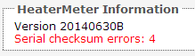

On the LinkMeter configuration page there is an indicator of how many times the communication between HeaterMeter and LinkMeter has been corrupted, labeled as "Serial checksum errors". This counter begs the question, how many errors is too many?

HeaterMeter transmits more than one data packet per second, so unless the number goes up every time you refresh the page, odds are serial errors aren't degrading your performance in any measurable fashion. When linkmeterd starts up, it almost always will get one checksum error as HeaterMeter is already sending data when the server starts. After that, one getting corrupted every hour isn't too bad, that's more than 99.9982% success! The only time you should be worried is if the number is continuously increasing.

### What happens to bad data?

The HeaterMeter protocol includes start and stop characters as well as checksums like NMEA structures that come from GPS devices.

~~~
$HMSU,65,82.6,U,43.2,90.7,0,0,0*7C
$HMSU,65,82.6,U,43.2,90.7,0,0,0*7C
$HMSU,65,82.6,U,43.2,90.7,0,0,0*7C
$HMSU,65,82.6,U,43.2,90.7,0,0,0*7C
$HMAR,0,1,0,0,0,1*16
$HMSU,65,82.6,U,43.2,90.7,0,0,0*7C
$HMSU,65,82.6,U,43.2,90.7,0,0,0*7C
$HMRF,255,0,255,63,0,3,9,4,1,28,4,2*17
$HMSU,65,82.6,U,43.2,90.7,0,0,0*7C
~~~

When the packet doesn't pass all the tests, it is discarded. For most messages, this is acceptable because new updated data will be along shortly to replace it. In the case of the configuration dump, this could lead to blank boxes showing up in the LinkMeter configuration webui. If this happens, you will not be able to edit any parameter which has a blank value. Simply use the "reboot avr" button to reset the HeaterMeter microcontroller and re-fetch the configuration.