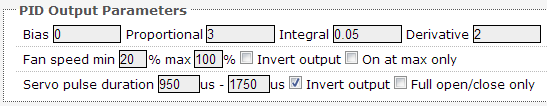
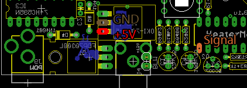

## Quick Setup Configuration
**DO THIS FIRST** Connecting a servo while HeaterMeter is set to fan mode could possibly damage your servo due to the high frequency and long pulse widths of that PWM mode stressing the motor.

From the web configuration page, set the output mode from "Fan" to "Servo" and adjust the pulse width. The minimum and maximum pulse width depends on the specifications of your servo, and are listed on the datasheet as "pulse width range".

Generally servos are centered at 1500us (sometimes listed as 1.5ms), so if the pulse range isn't known, just start with 500us on each side of that center. The web interface takes ranges in 10x microseconds so a 1000us to 2000us range would be entered as 100 to 200. Maximum supported values are ~20us to 2550us.

The range of motion can also be limited by adjusting the pulse durations. When in servo mode, the "blower speed" always ranges from 0% to 100% and simply interpolates between your minumum and maxiumum pulse durations. If it is desired that the servo only actuate to the 90 degree position rather than through its full rannge of motion, adjust the appropriate pulse value to restrict it. The easiest way to check range of motion is to set the HeaterMeter into manual fan mode, adjust the fan speed to 0% or 100% and then modifying the pulse duration through the web configuration page. Changes take effect immediately once sumbitted.

## Quick Setup Hardware
Servos use 3 wires instead of the 2 needed to drive the fan so a new connector must be soldered onto the HeaterMeter board. The connection points are +5V (Red), GND (Black or Brown), and Signal (Yellow, Orange, or White) and are shown here. Do not solder your servo wires directly to the board, because that would just be dumb to have them always connected.

## Technical
Servos are driven at 5V with a 3.3V 50Hz control signal. The control pulse is sent on the first 20-2550us of each period (maximum 12.75% duty cycle). Fan mode is 12V with a low side switch at 489Hz in "Fast PWM" mode, with a maximum 100% duty cycle.